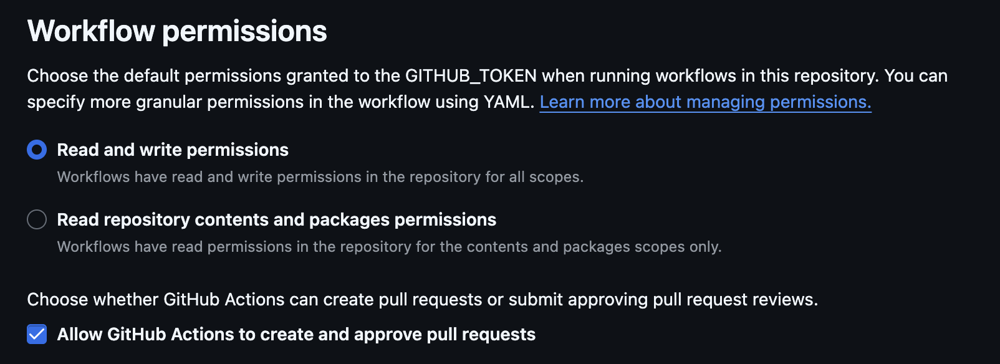

# ✨ GitHub Workflows ✨

- [✨ GitHub Workflows ✨](#-github-workflows-)
  - [⚠️ Requirements](#️-requirements)
  - [⚡ Available Workflows](#-available-workflows)
    - [🤖 Update UV Lockfile](#-update-uv-lockfile)
      - [Inputs](#inputs)
      - [Example](#example)

## ⚠️ Requirements

Some GitHub actions may use `{{ github.token }}` to authenticate and might require write access to the repository.
Make sure your repository has the following permissions in your repository settings:



## ⚡ Available Workflows

### 🤖 Update UV Lockfile

This workflow automatically updates your Python dependencies using `uv` and creates a pull request with the changes.

#### Inputs

| Input | Description | Required | Default |
|-------|-------------|:---------:|---------|
| `base_branch` | Branch to create PR against |  | `main` |
| `branch` | Branch to create the PR from |  | `update-uv` |
| `pr_title` | Title for the pull request |  | `[Deps] Update uv lockfile` |
| `working_directory` | Directory containing the Python project |  | `.` |

#### Example

```yaml
name: Update uv lockfile

on:
  workflow_dispatch:
  schedule:
    - cron: '0 0 * * 1'  # Run weekly on Monday

jobs:
  update-deps:
    uses: Jordan-Kowal/github-workflows/.github/workflows/update-uv-lockfile.yml@main
    with:
      base_branch: main
      branch: deps/update-uv-lockfile
      pr_title: '[Deps] Update uv lockfile'
      working_directory: .
```
